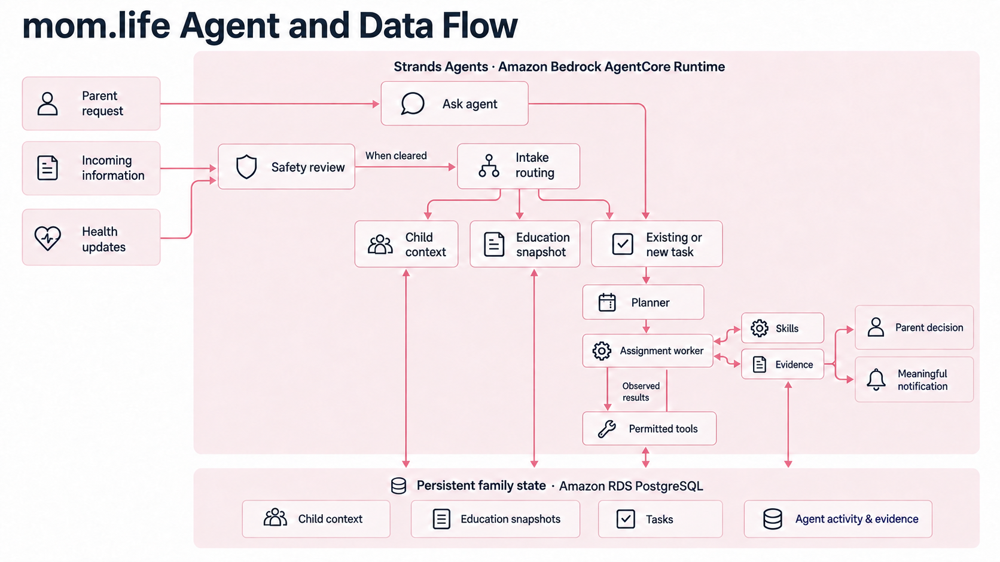
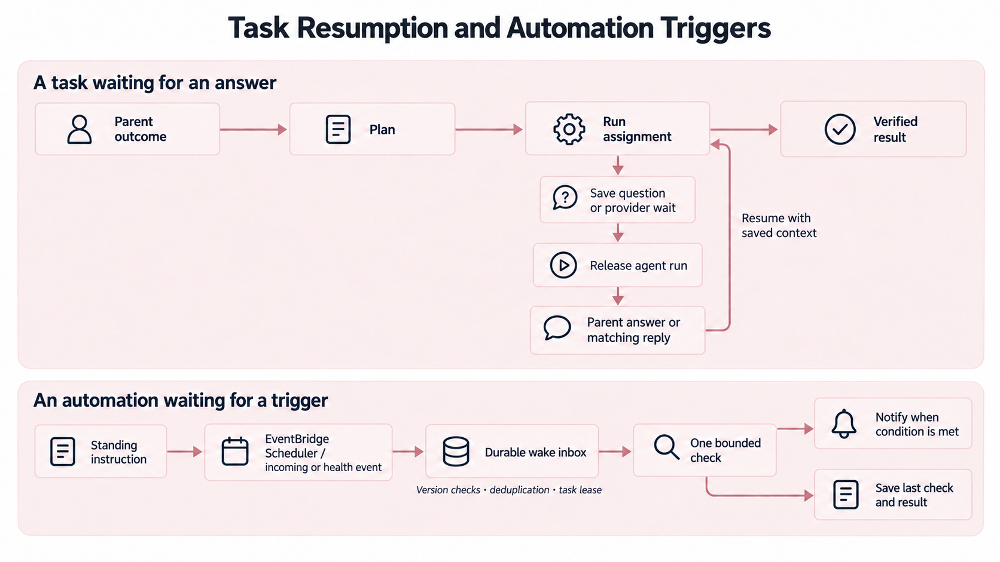
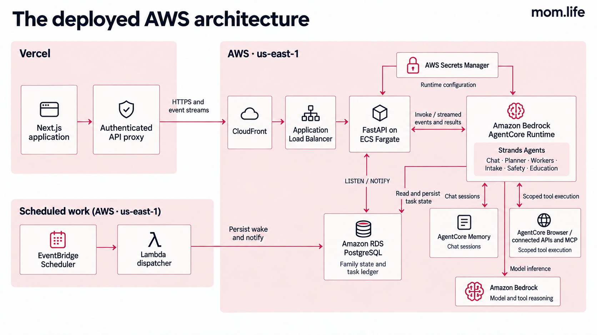

[](https://strandsagents.com/) [](https://aws.amazon.com/bedrock/agentcore/) [](https://mom-life-eight.vercel.app/sign-in) [](LICENSE)

# mom.life

mom.life is an agent for parents managing their children's school, health, safety, and everyday responsibilities. It keeps source-linked context for each child, carries out work through connected services, and returns to standing instructions when new information arrives or a scheduled check is due.

A parent's attention is spread across several lives. A teacher's message, a care instruction, and a change in sleep may arrive on different days, through different services. Someone has to retain that history, recognize what needs following up, and make sure the follow-up happens. mom.life gives that continuing work a home: child profiles, incoming evidence, education snapshots, tasks, and visible automations.

Built for the **Everyday Agents** track of the **Agents for Humans Hackathon**, using **Strands Agents SDK and Amazon Bedrock**, with agents deployed to **Amazon Bedrock AgentCore Runtime**.

## Live demo and workflow examples

[Open mom.life](https://mom-life-eight.vercel.app/sign-in). The shared demo account is `demo@mom.life`, password `MomLifeDemo!`. Creating an account gives you a separate family workspace.

The simulator supplies clearly labelled school, WhatsApp, and health events through the application's provider adapters. This makes waits and follow-ups observable during a short demonstration. Agent planning and execution use the configured Strands runtime.

These requests show three parts of the workflow. Replace names, dates, contacts, and conditions with the information in your workspace.

1. **School information becomes continuing context.** Add an incoming teacher observation for Amina, then ask: “Review Amina's recent school information. Tell me what has changed and prepare a short follow-up I can send to her teacher.” Inspect the original item, education snapshot, task assignments, and result.
2. **A task waits for an answer.** With the WhatsApp simulator enabled, ask the agent to message a caregiver at a supplied number about Noah's appointment, wait for their reply, and prepare a follow-up from the answer. Send a matching reply through the simulator. The task retains the message receipt and reply evidence across the wait.
3. **A standing instruction wakes later.** Ask: “In two minutes, review Amina's recent school information again. Notify me if there is a new unfinished assignment since this check.” Inspect the attached automation and its last result after it runs. You can also create an incoming-information or health-update trigger and supply a matching event.

Safety settings select children, sources, alert severity, review mode, evidence depth, and additional instructions. A review can use the current item or a small recent evidence slice. Alerts appear in-app; a flagged incoming item is held for the parent's attention before ordinary routing continues.

## Agent and data flow



The parent-facing Ask agent reads family context and the task board, answers questions, creates work, revises outcomes, and manages automations. It streams brief commentary and tool activity into the conversation.

The task planner translates an outcome into validated operations on a persisted assignment ledger. It can create, reuse, update, steer, retry, or cancel assignments. Workers run in dependency order, carrying selected skills, expected outputs, earlier evidence, and the parent's answers. A completed assignment records evidence for its requested result.

Workers are built from assignments and editable procedures. They discover only the family's permitted tool namespaces, load the exact schemas they need, and execute tools whose access is checked against current connection settings. A task can ask the parent for a missing decision or save a correlated provider wait and release its agent run. The answer resumes work with the saved instruction and receipts.

Incoming information is persisted before agent interpretation. Safety reviews the selected scope; Intake then chooses whether to record context, resume existing work, create a task, or request attention. Education maintains a source-linked account of learning changes for each child. Original evidence remains available beside the evolving summaries.

### Task resumption and automation triggers



An automation belongs to a task and saves a standing instruction, trigger, child scope, and last check result. Time-based rules use **Amazon EventBridge Scheduler**. A **Lambda dispatcher** validates the automation version, commits a deduplicated wake to PostgreSQL, and emits a database notification. Incoming and health triggers enter the same durable wake ledger.

The backend subscribes with PostgreSQL `LISTEN / NOTIFY` and drains saved wakes on startup. Task leases coordinate checks with existing work. Each check receives the original outcome, completed evidence, previous result, and new trigger information. It saves the current result and creates an in-app notification when the requested condition is met. Editing or pausing a rule invalidates older wakes.

This lets a responsibility outlive a chat request or backend process. The task board exposes its waiting state, questions, evidence, and attached rules.

### Connections and scope

| Connection | Work supported by the adapters |
| --- | --- |
| Google Workspace | Gmail reading and drafts, Drive discovery, Docs reading and updates, calendar availability and events |
| Google Classroom | Authorized courses, coursework, and announcements |
| WhatsApp Business | Requested outbound messages and correlated inbound replies through the business number |
| Fitbit and Withings | Authorized dated activity, sleep, and measurement records |
| Apple Health | Anchored sync ingestion; an iPhone application must supply permitted HealthKit data |
| Google Maps | Places, routes, and weather |
| Instacart | Shopping-list and recipe pages |
| Todoist, Notion, Canva | Tools discovered through their configured MCP connections |
| AgentCore Browser | Managed browser sessions with page inspection and observed-element interactions |

Connections require their provider credentials and permissions. Safety and monitoring operate on information actually supplied to the workspace or available through enabled connections. Social-platform account ingestion is a future integration area.

## Deployed AWS architecture



| Service | Responsibility |
| --- | --- |
| Vercel / Next.js | Parent interface and authenticated server-side API proxy |
| CloudFront / Application Load Balancer / ECS Fargate | HTTPS entry and FastAPI control plane: accounts, family APIs, callbacks, task coordination, and event streams |
| Bedrock AgentCore Runtime | VPC-connected Python application running Strands chat, planner, worker, intake, safety, and education operations |
| Amazon Bedrock | Model inference and tool reasoning through Strands `BedrockModel` |
| Amazon RDS PostgreSQL | Family data, source evidence, assignment state, automations, durable wakes, and notifications |
| AgentCore Memory | Persisted chat session events |
| AgentCore Browser | Managed browser execution for permitted assignments |
| EventBridge Scheduler / Lambda | Durable timed triggers and version-checked wake delivery |
| Secrets Manager / IAM | Runtime configuration, shared connection-encryption key, and service authorization |

The deployed split keeps task state in PostgreSQL while AgentCore hosts model-and-tool execution. Tools execute inside the hosted runtime with access to the ledger and authorized providers. Browser-facing requests use the authenticated API proxy. Chat events stream back through FastAPI; the serving process delivers family updates over SSE.

## Local setup

Requirements: **Node.js compatible with Next.js, pnpm, Python 3.14, PostgreSQL, and AWS credentials with Bedrock and AgentCore access**. Python 3.14 matches the deployment package. The backend uses PostgreSQL for application state.

```sh
pnpm install
python3.14 -m venv backend/.venv
backend/.venv/bin/pip install -r backend/requirements.txt
cp backend/.env.example backend/.env
```

Configure `backend/.env` for your own database and AWS identity:

```dotenv
MOM_LIFE_DATABASE_URL=postgresql://localhost/mom_life
MOM_LIFE_AWS_PROFILE=your-profile
MOM_LIFE_STRANDS_REGION=us-east-1
MOM_LIFE_STRANDS_MODEL_ID=moonshotai.kimi-k2.5
MOM_LIFE_AGENTCORE_MEMORY_ID=your-memory-id
MOM_LIFE_AGENTCORE_RUNTIME_ARN=your-runtime-arn
MOM_LIFE_CONNECTION_KEY=your-fernet-key
MOM_LIFE_CORS_ORIGINS=http://localhost:3000
```

Create the database before starting. Supply an AgentCore Memory resource for chat history. A runtime ARN selects hosted agent execution; leaving it empty runs Strands in the local backend with the configured AWS model access. Keep the same connection key in the API and hosted runtime. Generate a key with:

```sh
backend/.venv/bin/python -c 'from cryptography.fernet import Fernet; print(Fernet.generate_key().decode())'
```

Create `.env.local`:

```dotenv
MOM_LIFE_BACKEND_URL=http://127.0.0.1:8000
```

Start the API and frontend in separate terminals:

```sh
backend/.venv/bin/uvicorn app.main:app --app-dir backend --reload --host 127.0.0.1 --port 8000
```

```sh
pnpm dev
```

Open `http://localhost:3000`. Startup initializes application tables. Provider connections need their own OAuth registration, tokens, or MCP authorization. Timed automations additionally require the Scheduler target, execution role, and queue configuration written by the automation provisioning script.

### Deploy your own AWS backend

The provisioning scripts target the project's named AWS resources and record deployment state in `.build/cloud.json`. Review those names before using them in a different account. The runtime script expects an existing RDS PostgreSQL instance named `mom-life` and a working database URL. Its network setup includes private subnets and outbound connectivity for provider tools.

1. Package the Linux ARM64 Python runtime with `backend/scripts/package_agentcore.py` (requires `uv`).
2. Run `backend/scripts/provision_agentcore.py --profile your-profile` to provision the runtime, Memory, artifact storage, network access, roles, and configuration secret.
3. Run `PYTHONPATH=backend backend/.venv/bin/python backend/scripts/provision_automations.py --help`, supply the runtime's subnet and security-group IDs, and provision the Scheduler/Lambda stack. The script writes automation configuration into `backend/.env`; rerun after stack creation completes if it reports that configuration is not ready.
4. Run `backend/scripts/provision_backend.py --profile your-profile --image-tag your-tag`. On a new deployment it creates the ECR repository and reports the image destination. Build and push `backend/Dockerfile` as a Linux ARM64 image, then rerun to deploy ECS and the HTTPS entry.
5. Deploy the Next.js repository to Vercel. Set the server-only `MOM_LIFE_BACKEND_URL` to the CloudFront HTTPS endpoint and register your deployed OAuth callback URLs with providers.

These scripts provision cloud resources and incur AWS charges. Deployment output supplies your own runtime, Memory, endpoint, and network identifiers.

Run the packaging and runtime steps from the repository root:

```sh
backend/.venv/bin/python backend/scripts/package_agentcore.py
backend/.venv/bin/python backend/scripts/provision_agentcore.py --profile your-profile
```

For the API image, use the ECR repository reported by the backend script:

```sh
aws ecr get-login-password --region us-east-1 --profile your-profile | docker login --username AWS --password-stdin YOUR_ECR_REGISTRY
docker buildx build --platform linux/arm64 -f backend/Dockerfile -t YOUR_ECR_REPOSITORY:YOUR_TAG --push backend
backend/.venv/bin/python backend/scripts/provision_backend.py --profile your-profile --image-tag YOUR_TAG
```

## Validation

```sh
PYTHONPATH=backend backend/.venv/bin/pytest backend/tests
pnpm lint
pnpm build
git diff --check
```

The backend suite covers authentication and family isolation, planner operations, tool permissions, source intake, safety scope, provider waits, automation versions and leases, event streams, and simulator adapters. Tests that invoke configured models require AWS access. For an end-to-end check, follow a task from the parent request through tool receipts, a saved wait or scheduled wake, and the final recorded outcome.

## Source map

- `app/`: Next.js interface and server-side proxy routes.
- `backend/agents/`: Strands agent construction, prompts, and operational tools.
- `backend/app/`: FastAPI routes, persistence, task coordination, and automation management.
- `backend/plugins/`: Provider tools, connection permissions, OAuth, and browser adapters.
- `backend/agentcore_main.py`: Hosted operation entrypoint.
- `backend/scripts/`: Runtime packaging and AWS provisioning.
- `docs/architecture/`: Product and deployment diagrams.

## License

[MIT](LICENSE). Copyright © 2026 Victor Bash.
